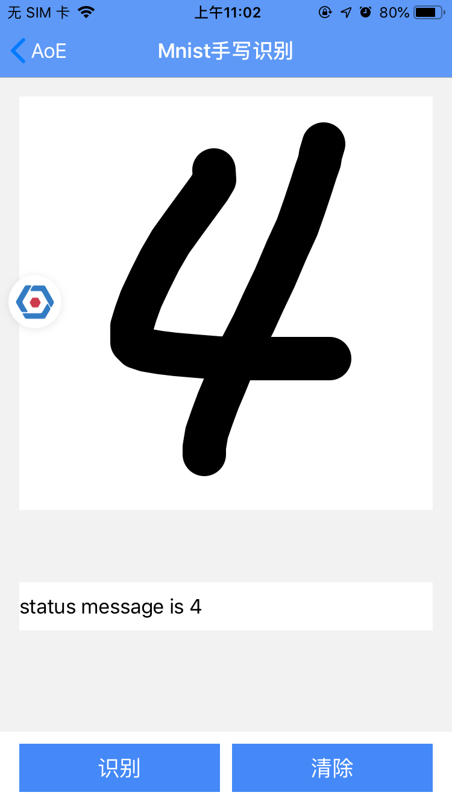
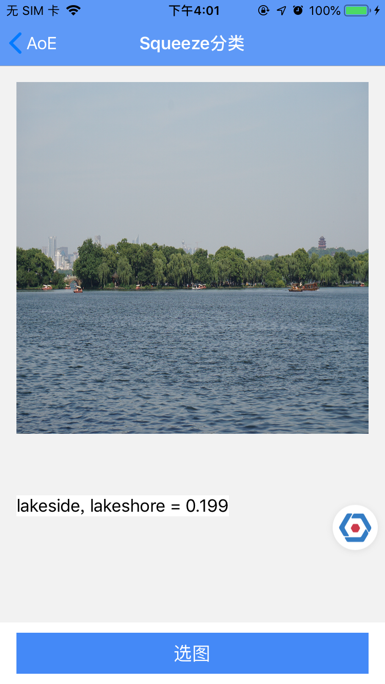

# AoE iOS 用户指南
[](https://cocoapods.org/pods/AoE)
[](https://cocoadocs.org/pods/AoE)
[](https://cocoadocs.org/pods/AoE)
## 简介
**AoE** 提供终端侧机器学习集成运行环境（IRE），实现方便拓展支持各种AI推理框架的运行，对上层业务提供统一的、轻量级、解藕的接口，提供独立进程运行机制，保障推理服务和数据处理实现对业务宿主的稳定运行不受影响。


SDK本身不包含推理框架，也不包括业务处理，需要用户自行实现，或者设置依赖。


## 示例Demo

[Demo](./samples/demo/demo) 我们提供了两个简单的例子，演示了如何使用 AoE SDK，使用不同的推理框架与组件来实现业务应用。


| 1. 基于 [TensorFLow Lite](https://www.tensorflow.org/lite/) 的 MNIST 手写数字识别 | 2. 基于 [NCNN](https://github.com/Tencent/ncnn) 的 SqueezeNet 物体识别 |
|---|---|
|   ||


## 集成使用

### 如何将SDK集成到应用？

AoE iOS SDK 最低支持版本为 `iOS 8.0+`

#### Cocoapods 集成

SDK提供了Cocoapods 的集成方式， 你只要在podfile 中添加如下代码即可。

```
pod AoE

```

> Tips: AoE SDK 本身包含3个子模块：`Core` 、`Loader` 、`Logger`。默认会加载 `Loader` , `Loader` 依赖 `Core`。 关于自定义组件请参考 [组件设计](./Component.md)


#### 手动集成

参照 `AoE.podspec ` 文件中的spec配置，按需copy文件到工程即可。

### 如何使用模型？

1. 设置要模型配置文件
2. 准备模型文件
3. 实现InterpreterComponent协议方法。
4. 注册Interpreter & 调用推理服务。

> Tips: 具体实现可以参考[Demo](./samples/demo/demo)程序以及 [概念介绍](./Concept.md) 文档。

### 如何设置模型配置文件？

AoE 自带的模型加载器需要使用下面的json格式文件，默认文件名称为 `model.config`

``` json
{
      "version": 1.0.0,
      "tag": "tag_mnist",
      "runtime": "tensorflow",
      "source": "installed",
      "modelDir": "mnist",
      "modelName": "mnist_cnn_keras"
}
```

> Tips: 如需定制协议请参考文档 [高级定制](./Advanced.md)

### 如何实现InterpreterComponent接口 ？

iOS目前AoE SDK支持两种组件：

* [InterpreterComponent](./CONCEPT.md#InterpreterComponent)
* [ModelOptionLoaderComponent](./CONCEPT.md#ModelOptionLoaderComponent)

InterpreterComponent为 **必须** 实现的组件(接口如下)，用于完成模型加载和数据预处理、后处理；

```objc
/**
 拦截器（推理模型逻辑的实例）组件接口协议
 */
@protocol AoEInterpreterComponentProtocol <AoEComponentProtocol>

/**
 拦截器配置模型

 @param options 配置组
 @return 是否加载配置成功
 */
- (BOOL)setupModel:(NSArray<id<AoEModelOptionProtocol>>*)options;

/**
 拦截器运行模型推理方法

 @param input 模型输入
 @return 模型输出
 */
- (id<AoEOutputModelProtocol>)run:(id<AoEInputModelProtocol>)input;


/**
 实例停止运行
 */
- (void)close;
@optional
/**
 判断模型是否已准备完成

 @return 是否已准备完成
 */
- (BOOL)isReady;

/// 预处理输入数据
/// @param input 外部输入数据
- (id)preProccessInput:(id<AoEInputModelProtocol>)input;

/// 预处理输出数据
/// @param outputData 模型输出数据
- (id<AoEOutputModelProtocol>)preProccessOutput:(id)outputData;
@end
```
ModelOptionLoaderComponent 可根据业务实际情况进行接口实现然后进行注册。

> Tip: 具体使用方法参见[MNIST](./AoEBiz/mnist/README.md) 的实现。

### 如何注册Interpreter & 调用推理服务 ？

请初始化`AoEClientOption`类，并给属性`interpreterClassName`赋值

构造AoeClient实例，显式声明InterpreterComponent实例，进行推理操作。

``` objc
// 1 声明AoEClientOption实例
AoEClientOption *clientOption = [AoEClientOption new];
clientOption.interpreterClassName = @"ABMnistInterceptor";
    
NSString *modelconfigDir = [[[NSBundle mainBundle] resourcePath] stringByAppendingPathComponent:@"AoEBiz-mnist.bundle/mnist"];
// 2 构造AoeClient交互实例
AoEClient *client = [[AoEClient alloc] initWithClientOption:clientOption ModelDir: modelconfigDir subDir:nil];

// 2 模型初始化，加载模型文件
AoEClientStatusCode statusCode = AoEClientStatusCodeForUndefine;
[client setupModel:^(AoEClientStatusCode statusCode) {
    }];
    
// 3 执行推理
id<AoEOutputModelProtocol> result = [client process:(id<AoEInputModelProtocol>)inputdata];


// 4 释放资源
[client close];
```

## 文档
* [概念介绍](./Concept.md)
* [架构设计](./Architecture.md)
* [组件设计](./Component.md)
* [高级定制](./Advanced.md)
* [发布历史](./ReleaseNotes.md)

## iOS三方依赖

[JSONModel](https://github.com/jsonmodel/jsonmodel/blob/master/LICENSE) iOS json序列化工具。

[TensorFlow](https://github.com/tensorflow/tensorflow/blob/master/LICENSE)  Google的机器学习推理框架。MNIST 功能演示如何使用 AoE 包装好的TensorFlow Lite组件，porting了mnist的示例工程。

[NCNN](https://github.com/Tencent/ncnn/blob/master/LICENSE.txt) 腾讯的神经网络前向计算框架。Squeeze 功能演示如何深度定制集成推理框架，porting了ncnn的示例工程。
